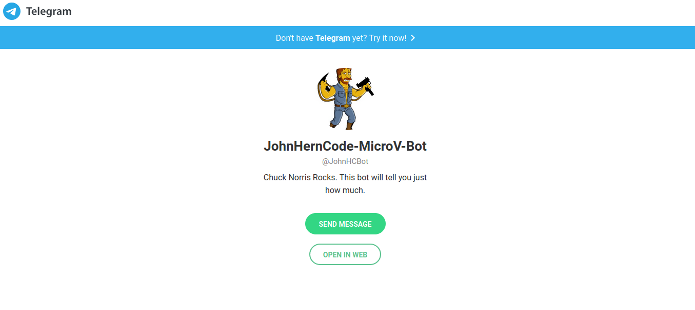

# Ruby-Bot- Microverse Ruby Project Capstone - Telgram Chuck Norris Info Bot

> This is the capstone project on the Microverse Ruby Module. The assignment called for creating a bot that was either useful or just plain fun. This bot also uses telegram to have fun with the user. 

## Screenshot

## Built With

- Ruby
- Rubocop

## Usage

- git clone git@github.com:JohnHernCode/Advanced-Building-Blocks-Enumerables.git
- cd ruby-bot
- Type "bundle install" to install dependencies.
- Type "bin/main.rb" to run the bot.
- The bot will not return a value in the terminal, but run in Telegram

## On Telegram
- Visit https://t.me/JohnHCBot
- Type /start (if it hasn't already)
- Follow the on screen instructions to play with the bot

## Authors

👤 **John hernandez**

- GitHub: [johnhernandez-code](https://github.com/johnhernandez-code)
- Twitter: [@JohnHernCode](https://twitter.com/JohnHernCode)
- LinkedIn: [LinkedIn](https://www.linkedin.com/in/john-hernandez-56a7821b8/)

## 🤝 Contributing

Contributions, issues, and feature requests are welcome!

## Show your support

Give a ⭐️ if you like this project!

## Acknowledgments

Thanks for the both parties involved in the development of this project.

## 📝 License

This project is [MIT](https://opensource.org/licenses/MIT) licensed.
